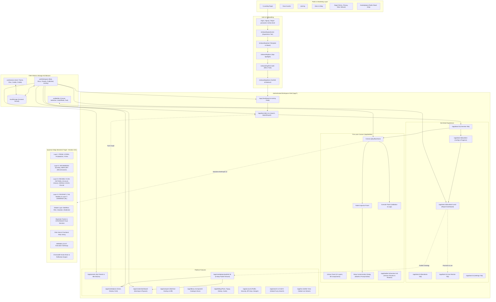

# ⚡ AETHER / QUANTUM EDGE — MASTER CONTEXT GRAPH & ARCHITECTURE ENCYCLOPEDIA
> **The Definitive, Multi-Layered Knowledge Base & Memory Graph for LLMs and Human Engineers**
> *Version:* 2.0 (Post-Phase 9 Frontend Freeze + Quantum Edge Backend Blueprint)  
> *Workspace Root:* `/home/neeraj/Desktop/Coding/Trading/My Trading Bot`  
> *Target System:* AETHER (No-Code Visual Trading Agent Builder) & QUANTUM EDGE (Agentic Multi-Layer Crypto Trading System)

---

## 📌 TABLE OF CONTENTS (HYPERLINKED TOPOLOGY)

- [§0. QUICK REFERENCE CARD & LLM EXECUTION CHEAT SHEET](#0-quick-reference-card--llm-execution-cheat-sheet)
- [§1. PROJECT IDENTITY, VISION & CORE PHILOSOPHY](#1-project-identity-vision--core-philosophy)
- [§2. THE MASTER MEMORY GRAPH & KNOWLEDGE TOPOLOGY](#2-the-master-memory-graph--knowledge-topology)
  - [2.1 High-Level Architecture Flow (Mermaid Graph)](#21-high-level-architecture-flow-mermaid-graph)
  - [2.2 Adjacency Matrix & Dependency Index](#22-adjacency-matrix--dependency-index)
- [§3. PRODUCT ARCHITECTURE & CORE SUBSYSTEMS](#3-product-architecture--core-subsystems)
  - [3.1 The 13-Layer Trading Agent Model](#31-the-13-layer-trading-agent-model)
  - [3.2 The Builder Canvas ("The Loom")](#32-the-builder-canvas-the-loom)
  - [3.3 Node System, Typed Ports & Structural Validation](#33-node-system-typed-ports--structural-validation)
  - [3.4 Deep Customization, Model Selection & Variable Mapping](#34-deep-customization-model-selection--variable-mapping)
  - [3.5 Monetization, Gating & Razorpay Integration](#35-monetization-gating--razorpay-integration)
  - [3.6 Marketplace, Presets & Creator Economy](#36-marketplace-presets--creator-economy)
- [§4. COMPLETE ROUTE MAP & 59-PAGE INVENTORY](#4-complete-route-map--59-page-inventory)
- [§5. DESIGN SYSTEM: "AETHER GLASS"](#5-design-system-aether-glass)
  - [5.1 Design Philosophy & Color Palette](#51-design-philosophy--color-palette)
  - [5.2 Typography, Radius & Elevation](#52-typography-radius--elevation)
  - [5.3 Dual Motion System (GSAP + Framer Motion)](#53-dual-motion-system-gsap--framer-motion)
  - [5.4 Component Primitives Catalog (22 Primitives)](#54-component-primitives-catalog-22-primitives)
- [§6. TECH STACK, CODEBASE ANATOMY & FILE INDEX](#6-tech-stack-codebase-anatomy--file-index)
  - [6.1 Technology Stack & Core Libraries](#61-technology-stack--core-libraries)
  - [6.2 State Management & Persistence Architecture](#62-state-management--persistence-architecture)
  - [6.3 Annotated Codebase File Index (152 Files)](#63-annotated-codebase-file-index-152-files)
- [§7. DATA MODEL & SCHEMA SPECIFICATIONS](#7-data-model--schema-specifications)
  - [7.1 Canonical Canvas Schema: `BotGraph` (v2)](#71-canonical-canvas-schema-botgraph-v2)
  - [7.2 Entity Schemas: `Bot`, `BotVersion`, `Preset`, `MyPreset`, `PublishedPreset`](#72-entity-schemas-bot-botversion-preset-mypreset-publishedpreset)
  - [7.3 Simulation & Execution: `BacktestRun`, `Trade`, `EquityPoint`, `Metrics`](#73-simulation--execution-backtestrun-trade-equitypoint-metrics)
  - [7.4 Component Definition & Configuration Schemas](#74-component-definition--configuration-schemas)
- [§8. BUILD HISTORY & PROMPT CHRONICLE (PHASES 0–9)](#8-build-history--prompt-chronicle-phases-09)
- [§9. QUANTUM EDGE BACKEND BLUEPRINT (ITERATION 101)](#9-quantum-edge-backend-blueprint-iteration-101)
  - [9.1 4-Stage Validation Pipeline](#91-4-stage-validation-pipeline)
  - [9.2 Named Agent Ecosystem (Layers 0 to V)](#92-named-agent-ecosystem-layers-0-to-v)
  - [9.3 OCULUS: Multimodal Vision Chart Reader](#93-oculus-multimodal-vision-chart-reader)
  - [9.4 ML Ensemble & Reinforcement Learning](#94-ml-ensemble--reinforcement-learning)
  - [9.5 Memory Systems: ChromaDB Vector DB & Reflection Engine](#95-memory-systems-chromadb-vector-db--reflection-engine)
- [§10. GROUND RULES, CONVENTIONS & ANTI-PATTERNS](#10-ground-rules-conventions--anti-patterns)
- [§11. CURRENT STATE, VERIFICATION MATRIX & ROADMAP](#11-current-state-verification-matrix--roadmap)
- [§12. GLOBAL CROSS-REFERENCE & TOKEN-OPTIMIZED INDEX](#12-global-cross-reference--token-optimized-index)

---

## §0. QUICK REFERENCE CARD & LLM EXECUTION CHEAT SHEET

```
┌───────────────────────────────────────────────────────────────────────────────────────────────────┐
│                                   ⚡ AETHER QUICK REFERENCE                                       │
├───────────────────────────────────────────────────────────────────────────────────────────────────┤
│ WHAT IS AETHER?   No-code visual drag-and-drop builder for algorithmic trading agents (n8n/Zapier │
│                   for trading bots). Users assemble nodes across 12-13 layers, run deterministic │
│                   backtests, monitor paper trading ("Aether View"), and monetize presets.        │
│ CURRENT STATE     Frontend frozen (Phases 0–9 complete). 100% mocked with deterministic client   │
│                   simulation, Zustand localStorage persistence, 59 routes, 152 source files.     │
│ CORE SCHEMA       `BotGraph` schemaVersion: 2 (holds `nodes`, `edges`, `notes`, `frames`).       │
│ TECH STACK        Next.js 16 (App Router), React 19, TypeScript (strict), Tailwind v4 (CSS vars), │
│                   Zustand (persist), @xyflow/react (React Flow), Recharts, Base UI primitives.    │
│ BACKEND TARGET    "Quantum Edge" (Iteration 101): Python LangGraph multi-agent crypto system      │
│                   (ChromaDB memory, 7-model ML ensemble, multi-LLM debate, OCULUS visual reader).│
│ MONETIZATION      Free / Starter (₹799/mo) / Pro (₹1,999/mo) / PAYG Credits (₹499/₹999 bundles). │
│ CRITICAL RULES    1. Deterministic data first; LLM reasoning second.                             │
│                   2. Paper trading by default. Never promise financial advice.                   │
│                   3. All monetary numbers formatted in INR (₹) via `lib/utils.ts`.                │
│                   4. No raw `localStorage` calls; state goes through Zustand persist stores.     │
│                   5. Zero native `confirm()` or `alert()`; use `ConfirmDialog` primitive.        │
└───────────────────────────────────────────────────────────────────────────────────────────────────┘
```

### Where to Look for Specific Tasks:
- **Modifying Node Inspector / Fields:** See [§3.4](#34-deep-customization-model-selection--variable-mapping) and [`Codebase/components/builder/inspector.tsx`](file:///home/neeraj/Desktop/Coding/Trading/My%20Trading%20Bot/Codebase/components/builder/inspector.tsx) + [`mock/layers.ts`](file:///home/neeraj/Desktop/Coding/Trading/My%20Trading%20Bot/Codebase/mock/layers.ts).
- **Adding or Debugging Routes:** See [§4](#4-complete-route-map--59-page-inventory) and [`Codebase/app/`](file:///home/neeraj/Desktop/Coding/Trading/My%20Trading%20Bot/Codebase/app).
- **Modifying Canvas Mechanics:** See [§3.2](#32-the-builder-canvas-the-loom) and [`Codebase/components/builder/canvas.tsx`](file:///home/neeraj/Desktop/Coding/Trading/My%20Trading%20Bot/Codebase/components/builder/canvas.tsx) + [`lib/builder-store.ts`](file:///home/neeraj/Desktop/Coding/Trading/My%20Trading%20Bot/Codebase/lib/builder-store.ts).
- **Understanding Quantum Edge Backend:** See [§9](#9-quantum-edge-backend-blueprint-iteration-101) and [`Iteration 101/MASTER_BLUEPRINT.md`](file:///home/neeraj/Desktop/Coding/Trading/My%20Trading%20Bot/Iteration%20101/MASTER_BLUEPRINT.md).
- **Inspecting Global State:** See [§6.2](#62-state-management--persistence-architecture) and [`lib/workspace-store.ts`](file:///home/neeraj/Desktop/Coding/Trading/My%20Trading%20Bot/Codebase/lib/workspace-store.ts), [`lib/store.ts`](file:///home/neeraj/Desktop/Coding/Trading/My%20Trading%20Bot/Codebase/lib/store.ts).

---

## §1. PROJECT IDENTITY, VISION & CORE PHILOSOPHY

### 1.1 The One-Line Pitch
**AETHER** is a visual, drag-and-drop builder for algorithmic trading agents. Instead of writing complex Python infrastructure, quantitative traders and retail enthusiasts assemble bots from modular, toggleable nodes (data feeds, feature extractors, LLM reasoning agents, ML prediction models, risk filters, order routers, and self-learning memory loops), backtest them with deterministic simulations, and pay only for unlocked compute and layers.

### 1.2 The Problem
1. **Infrastructure Barrier:** Building a serious algorithmic trading bot requires wiring WebSockets, feature engineering pipelines, model inference, risk controls, and order routing before testing a single strategy.
2. **Attribution Opacity:** Black-box bots make it impossible to isolate *which* node (e.g., Sentiment Agent vs. Risk Stop-Loss) added value or destroyed alpha.
3. **Distribution & Monetization Friction:** Strategy creators have no clean, standardized format to package, verify, publish, and monetize their architectural graphs.

### 1.3 The Core Insight
A trading bot is fundamentally a **Directed Acyclic Graph (DAG) of interchangeable nodes grouped into pipeline layers**. By exposing this graph visually with typed ports and deterministic validation, strategy creation becomes as accessible and modular as Zapier or n8n, while retaining institutional-grade risk gates and multi-agent debate capabilities.

### 1.4 Target Audience
- **Retail / Hobbyist Builders:** Want to test trading hypotheses without writing Python/C++ infrastructure.
- **Quant-Curious Developers:** Want to swap in custom prompts, ML models, or alternative feeds without rebuilding execution pipelines.
- **Strategy Creators & Sellers:** Want to package, backtest, and sell verified configurations in a community marketplace.
- **Learners:** Want to understand algorithmic dynamics via transparent layer-by-layer contribution attribution.

### 1.5 Explicit Non-Goals (What AETHER Is Not)
- **NOT a Signal Service:** AETHER does not provide financial advice, tips, or "buy/sell alerts."
- **NOT Live Real-Money Trading by Default:** The core demo and default execution is **100% paper trading**. Real-fund execution is a gated, heavily verified, opt-in future tier with explicit risk disclosures.
- **NOT a Black-Box Optimizer:** Every metric must show true drawdowns, win rates, execution slippage, and layer contributions without cherry-picking.

---

## §2. THE MASTER MEMORY GRAPH & KNOWLEDGE TOPOLOGY

### 2.1 High-Level Architecture Flow (Mermaid Graph)



### 2.2 Adjacency Matrix & Dependency Index

| Component / Subsystem | Primary Source File | Dependencies | Consumers / Upstream Targets |
|---|---|---|---|
| **`BotGraph` Schema v2** | [`mock/data.ts`](file:///home/neeraj/Desktop/Coding/Trading/My%20Trading%20Bot/Codebase/mock/data.ts#L48) | None | `useWorkspace`, `useBuilder`, `cloneGraph`, `exportBot` |
| **`cloneGraph()` Engine** | [`lib/graph-utils.ts`](file:///home/neeraj/Desktop/Coding/Trading/My%20Trading%20Bot/Codebase/lib/graph-utils.ts) | `BotGraph`, `slugId` | `createBot`, `duplicateBot`, `forkPreset`, `savePreset`, `publishPreset` |
| **Workspace Store** | [`lib/workspace-store.ts`](file:///home/neeraj/Desktop/Coding/Trading/My%20Trading%20Bot/Codebase/lib/workspace-store.ts) | `mock/data.ts`, `mock/layers.ts` | All `/app/*` pages, `AppShell`, `AppTopBar` |
| **Builder Store** | [`lib/builder-store.ts`](file:///home/neeraj/Desktop/Coding/Trading/My%20Trading%20Bot/Codebase/lib/builder-store.ts) | `xyflow`, `workspace-store` | `Canvas`, `Inspector`, `BuilderToolbar`, `ConsolePanel` |
| **Session & Auth Store** | [`lib/store.ts`](file:///home/neeraj/Desktop/Coding/Trading/My%20Trading%20Bot/Codebase/lib/store.ts) | `mock/data.ts` | `AppShell`, `DevPanel`, `AccountMenu`, `Billing` |
| **Structural Validation** | [`lib/validate.ts`](file:///home/neeraj/Desktop/Coding/Trading/My%20Trading%20Bot/Codebase/lib/validate.ts) | `mock/layers.ts` | `ConsolePanel`, `BuilderToolbar`, `validateGraphIntegrity` |
| **Field Renderer** | [`components/builder/field-renderer.tsx`](file:///home/neeraj/Desktop/Coding/Trading/My%20Trading%20Bot/Codebase/components/builder/field-renderer.tsx) | `FieldDef`, Base UI | `Inspector`, `DeepCustomizationDialog` |
| **Model Registry** | [`mock/models.ts`](file:///home/neeraj/Desktop/Coding/Trading/My%20Trading%20Bot/Codebase/mock/models.ts) | None | `ModelSelectField`, `DeepCustomizationDialog` |
| **Deterministic Backtest Engine** | `generateBacktest()` in [`mock/data.ts`](file:///home/neeraj/Desktop/Coding/Trading/My%20Trading%20Bot/Codebase/mock/data.ts) | Random seed, Config | `BacktestConfigPage`, `RunProgress` |

---

## §3. PRODUCT ARCHITECTURE & CORE SUBSYSTEMS

### 3.1 The 13-Layer Trading Agent Model
AETHER structures every trading bot as a sequential pipeline across 13 distinct layers. In the UI and builder, these are represented as colored horizontal bands ("Layer Bands") with Roman numerals:

| Layer Index | Layer ID | Name | Accent Hue | Core Role |
|---|---|---|---|---|
| **0** | `orchestration` | **Layer 0 — Orchestration** | Slate (`#64748B`) | Supervisor loop, execution dispatcher, global limits (NEXUS, HERMES). |
| **I** | `data-sources` | **Layer I — Data Collection** | Cyan (`#06B6D4`) | Ingests OHLCV, orderbook depth, funding rate, on-chain flows, news, macro feeds. |
| **II** | `features` | **Layer II — Feature Engineering** | Sky (`#0EA5E9`) | Technical indicators (50+ via Numba/TA), order-book delta, liquidity sweeps. |
| **III** | `regime-intel` | **Layer III — Intelligence Agents** | Indigo (`#6366F1`) | Specialized analytical agents (Technical, Sentiment, Macro, Flow, Pattern, Oculus). |
| **IV** | `prediction` | **Layer IV — ML Prediction** | Violet (`#8B5CF6`) | 7-model ML ensemble (LSTM, XGBoost, CatBoost, LightGBM, RF, GNN, GRU). |
| **V** | `rl-agent` | **Layer V — Reinforcement Learning** | Fuchsia (`#D946EF`) | PPO/SAC position sizing and action policy learned against reward signal. |
| **VI** | `debate` | **Layer VI — Debate Layer** | Amber (`#F59E0B`) | Multi-agent adversarial debate (Bull vs. Bear, Risk vs. Reward, Moderator). |
| **VII** | `confidence` | **Layer VII — Confidence Engine** | Emerald (`#10B981`) | Bayesian confidence fusion, signal agreement weighting, veto conditions. |
| **VIII** | `risk` | **Layer VIII — Risk Management** | Rose (`#F43F5E`) | Hard pre-trade risk gates, max drawdown breaker, position sizing, Kelly criterion. |
| **IX** | `execution` | **Layer IX — Execution** | Blue (`#3B82F6`) | Order routing, slippage tolerance, TWAP/VWAP smart routing, exchange gateway. |
| **X** | `monitoring` | **Layer X — Trade Monitoring** | Teal (`#14B8A6`) | Post-entry position tracking, dynamic trailing stops, profit targets. |
| **XI** | `learning` | **Layer XI — Self-Learning Loop** | Purple (`#A855F7`) | Post-mortem autopsies, mistake classification, rule clustering. |
| **XII** | `memory` | **Layer XII — Memory Systems** | Pink (`#EC4899`) | Vector trade retrieval (ChromaDB), episodic experience, trade reflection memory. |

### 3.2 The Builder Canvas ("The Loom")
Located at `/app/builder/:botId`, this is the centerpiece application interface:
- **Canvas Engine:** Built on `@xyflow/react` (React Flow v12) with infinite pan, zoom (10%–200%), minimap, snap-to-grid, and marquee multi-selection.
- **Layer Bands:** Translucent colored background bands matching the 13 layers auto-expand to envelop nodes. Bands can be collapsed into compact summary chips.
- **Toolbar:** Inline bot renaming, Save, Undo/Redo, Save as Preset, Version History dropdown, Validate, Templates, Share, Run Backtest (primary), and Go Live (gated).
- **Small-Screen Fallback:** Automatically renders a desktop-primary banner below 1024px viewport width.

### 3.3 Node System, Typed Ports & Structural Validation
Nodes have input ports on the left and output ports on the right. Ports are strictly typed to enforce pipeline correctness:
- **Port Types:**
  - `MarketData` (Cyan) — Raw candle & ticker streams
  - `NewsFeed` (Amber) — Textual headlines & sentiment strings
  - `FeatureVector` (Sky) — Computed numeric matrices & indicator arrays
  - `Signal` (Indigo) — Directional opinion (-1.0 to +1.0) with confidence score (0.0 to 1.0)
  - `RiskDecision` (Rose) — Authorized trade parameters, size cap, stop-loss price
  - `ExecutionOrder` (Blue) — Actionable exchange order object
  - `TradeOutcome` (Teal) — Closed trade telemetry, P&L, execution slippage

- **Validation Engine (`lib/validate.ts`):**
  1. Execution nodes cannot connect directly to raw Data Collection nodes (Risk Management node must mediate).
  2. Self-learning nodes require at least one Trade Monitoring output.
  3. No dangling output edges connecting to incompatible port types.
  4. Prompt variable syntax `{{variable}}` must match actual incoming connected edges.

### 3.4 Deep Customization, Model Selection & Variable Mapping
Every node features a two-tiered configuration model:
1. **Core Parameters (Inspector):** 2–4 high-impact fields displayed in the right sidebar panel.
2. **Deep Customization Dialog:** Full-screen modal accessed via the "Deep Customization" button with 4 tabs:
   - **Configuration:** All basic and advanced fields rendered via the unified [`field-renderer.tsx`](file:///home/neeraj/Desktop/Coding/Trading/My%20Trading%20Bot/Codebase/components/builder/field-renderer.tsx).
   - **Model & Prompt:** Select hosted LLMs (OpenAI, Anthropic, Google, DeepSeek, Qwen) or local Ollama instances (`http://localhost:11434`), adjust temperature/maxTokens, and edit full prompt templates with dynamic `{{input_variable}}` chips derived from incoming edges.
   - **Documentation:** When to use, when to skip, best practices, and common failure modes.
   - **Advanced / Reset:** Raw JSON export/import of node configuration and "Reset to Defaults".

### 3.5 Monetization, Gating & Razorpay Integration
Monetization is managed through Plan Tiers and PAYG Credit Balances:
- **Free Tier (₹0):** Basic node graph assembly, historical backtesting (up to 10 runs/month), public marketplace browsing.
- **Starter Tier (₹799/mo or ₹7,990/yr):** Unlocks Layer III & IV advanced indicators, 150 backtests/month, standard paper trading.
- **Pro Tier (₹1,999/mo or ₹19,990/yr):** Unlimited backtests, full Multi-Agent Debate, RL DARWINEX module, continuous Self-Learning, Webhooks & API Keys, 80% Marketplace Creator revenue share.
- **Pay-As-You-Go Credits:** ₹499 (500 credits) / ₹999 (1000 credits) for one-off node unlocks and backtest runs.
- **Simulated Checkout:** `UnlockDialog` simulates realistic Razorpay checkout with UPI / Card tabs and realistic async delays.

### 3.6 Marketplace, Presets & Creator Economy
- **Unified Catalog:** Powered by `useMarketplacePresets()` which merges static seeds with user-published bots.
- **Publish Wizard (`/app/marketplace/publish/:botId`):** 5-step wizard requiring backtest proof before publishing. Captures the complete `BotGraph` v2 snapshot.
- **Creator Dashboard (`/app/creator/dashboard`):** Real-time tracking of downloads, clones, revenue, rating, and payout requests.

---

## §4. COMPLETE ROUTE MAP & 59-PAGE INVENTORY

Every single page in the codebase is a fully implemented, working client-side route:

| Route Path | Access Tier | Primary Component / Layout | Data Sources Read/Written | Key User Actions & Features |
|---|---|---|---|---|
| `/` | `[PUB]` | `app/page.tsx`, `Hero`, `FeatureGrid`, `LayerShowcase` | Static marketing fixtures | Hero canvas preview, pricing teaser, FAQ, CTA |
| `/how-it-works` | `[PUB]` | `app/how-it-works/page.tsx` | Static explainer | 4-step interactive pipeline visual |
| `/pricing` | `[PUB]` | `app/pricing/page.tsx`, `PlanComparison` | `PLANS`, `PLAN_COMPARISON`, `FAQS` | Monthly/Annual toggle, feature matrix, Razorpay CTA |
| `/marketplace` | `[PUB]` | `app/marketplace/page.tsx` | `useMarketplacePresets()` | Public preset browsing, category filter, "Sign up to clone" |
| `/marketplace/[presetId]` | `[PUB]` | `app/marketplace/[presetId]/page.tsx` | `useMarketplacePresets()` | Preset detail, backtest equity curve, author bio |
| `/docs` | `[PUB]` | `app/docs/page.tsx` | `DOC_SECTIONS` | Searchable documentation hub |
| `/docs/[slug]` | `[PUB]` | `app/docs/[slug]/page.tsx` | `DOC_SECTIONS.find(slug)` | Deep-dive guide reader, code snippets, callouts |
| `/blog` | `[PUB]` | `app/blog/page.tsx` | `BLOG_POSTS` | Article grid, category tags, reading time |
| `/blog/[slug]` | `[PUB]` | `app/blog/[slug]/page.tsx` | `BLOG_POSTS.find(slug)` | Article view with "Full article coming soon" notice |
| `/legal/terms` | `[PUB]` | `app/legal/terms/page.tsx` | `LegalPageLayout` | Terms of Service (Indian jurisdiction, IP terms) |
| `/legal/privacy` | `[PUB]` | `app/legal/privacy/page.tsx` | `LegalPageLayout` | Privacy Policy (Strategy data non-disclosure terms) |
| `/legal/risk-disclosure` | `[PUB]` | `app/legal/risk-disclosure/page.tsx` | `LegalPageLayout` | Explicit risk disclaimer (Paper trading by default) |
| `/legal/refund-policy` | `[PUB]` | `app/legal/refund-policy/page.tsx` | `LegalPageLayout` | 7-day refund policy, credit non-expiration terms |
| `/login` | `[PUB]` | `app/login/page.tsx` | `useSession.setAuthed` | Mock authentication, OAuth buttons, Forgot Password link |
| `/signup` | `[PUB]` | `app/signup/page.tsx` | `useSession.setAuthed`, `updateProfile` | Account creation, name capture, redirect to onboarding |
| `/forgot-password` | `[PUB]` | `app/forgot-password/page.tsx` | Local state machine | Mock password reset email dispatch |
| `/reset-password` | `[PUB]` | `app/reset-password/page.tsx` | Query token via `Suspense` | Set new password, validation, redirect to login |
| `/verify-email` | `[PUB]` | `app/verify-email/page.tsx` | Query token via `Suspense` | Email confirmation landing, redirect to `/app` |
| `/onboarding/welcome` | `[AUTH]` | `app/onboarding/welcome/page.tsx` | `setOnboardingAnswer` | Experience selection (Beginner / Intermediate / Advanced) |
| `/onboarding/start` | `[AUTH]` | `app/onboarding/start/page.tsx` | `forkPreset`, `createBot` | Template vs. Blank Canvas picker |
| `/onboarding/tour` | `[AUTH]` | `app/onboarding/tour/page.tsx`, `SpotlightTour` | Active draft bot | 5-step interactive app shell spotlight tour |
| `/onboarding/first-node` | `[AUTH]` | `app/onboarding/first-node/page.tsx` | `useBuilder.nodes` observer | Micro-task: drag Data Source node onto canvas |
| `/onboarding/done` | `[AUTH]` | `app/onboarding/done/page.tsx` | `setOnboardingComplete` | Success celebration + redirect to first backtest |
| `/app` | `[AUTH]` | `app/app/page.tsx`, `AppShell` | `useWorkspace.bots`, `activity`, `runs` | Metric stats, active bots, live activity feed |
| `/app/builder` | `[AUTH]` | `app/app/builder/page.tsx` | `useWorkspace.bots` | Bot picker / quick redirect to last edited bot |
| `/app/builder/[botId]` | `[AUTH]` | `app/app/builder/[botId]/page.tsx`, `Canvas` | `useWorkspace`, `useBuilder` | The Loom: Drag-and-drop canvas, library, inspector |
| `/app/builder/[botId]/version/[versionId]` | `[AUTH]` | `app/app/builder/[botId]/version/...` | `bot.versions.find(vId)` | Read-only canvas version preview & full restore |
| `/app/bots` | `[AUTH]` | `app/app/bots/page.tsx` | `useWorkspace.bots`, `deleteBot` | Grid/List bot manager, tag filter, JSON Import |
| `/app/bots/[botId]` | `[AUTH]` | `app/app/bots/[botId]/page.tsx`, `BotHeader` | `useBot(botId)` | Tabbed hub (Overview, Backtests, Live, Settings) |
| `/app/bots/[botId]/backtest` | `[AUTH]` | `app/app/bots/[botId]/backtest/page.tsx` | `generateBacktest`, `addRun` | Backtest config panel, simulated streaming run |
| `/app/bots/[botId]/backtest/[runId]` | `[AUTH]` | `app/app/bots/[botId]/backtest/[runId]/...` | `useRun(runId)` | Results dashboard: Recharts equity, metrics, trade log |
| `/app/presets` | `[AUTH]` | `app/app/presets/page.tsx` | `useWorkspace.myPresets` | Private presets, version history, duplicate, delete |
| `/app/presets/[presetId]` | `[AUTH]` | `app/app/presets/[presetId]/page.tsx` | `useWorkspace.myPresets` | Detailed preset inspection & load-into-builder |
| `/app/marketplace` | `[AUTH]` | `app/app/marketplace/page.tsx` | `useMarketplacePresets()` | Authenticated marketplace: Clone, Star, Filter |
| `/app/marketplace/[presetId]` | `[AUTH]` | `app/app/marketplace/[presetId]/page.tsx` | `useMarketplacePresets()` | Authenticated preset view with Clone & Report modal |
| `/app/marketplace/publish/[botId]` | `[AUTH, GATED]` | `app/app/marketplace/publish/...` | `publishPreset`, `bot.graph` | 5-step publish wizard with backtest verification |
| `/app/creator/dashboard` | `[AUTH, GATED]` | `app/app/creator/dashboard/page.tsx` | `publishedPresets`, `CREATOR_EARNINGS` | Sales metrics, clone counts, payout request |
| `/app/compare` | `[AUTH]` | `app/app/compare/page.tsx` | `bots`, `runs`, `marketplacePresets` | Side-by-side 4-bot overlay, diff & equity comparison |
| `/app/library` | `[AUTH]` | `app/app/library/page.tsx` | `COMPONENTS`, `LAYERS` | Browsable 68-component catalog with layer filters |
| `/app/library/[componentId]` | `[AUTH]` | `app/app/library/[componentId]/page.tsx` | `COMPONENT_MAP` | Deep component docs, port definitions, "Try in bot" |
| `/app/live` | `[AUTH]` | `app/app/live/page.tsx` | `OPEN_POSITIONS`, `LIVE_LOGS` | Global Aether View: Streaming live paper trades |
| `/app/billing` | `[AUTH]` | `app/app/billing/page.tsx` | `useSession`, `useWorkspace` | Current plan overview, usage progress bars, credits |
| `/app/billing/plans` | `[AUTH]` | `app/app/billing/plans/page.tsx` | `PLANS`, `setPlan` | In-app plan upgrade / downgrade matrix |
| `/app/billing/topup` | `[AUTH]` | `app/app/billing/topup/page.tsx` | `CREDIT_BUNDLES`, `addCredits` | Buy PAYG credit bundles with simulated Razorpay |
| `/app/billing/history` | `[AUTH]` | `app/app/billing/history/page.tsx` | `INVOICES` | Invoice table with client-side downloadable receipts |
| `/app/billing/payment-methods` | `[AUTH]` | `app/app/billing/payment-methods/page.tsx` | `PAYMENT_METHODS` | Saved card / UPI manager with default selector |
| `/app/billing/credits` | `[AUTH]` | `app/app/billing/credits/page.tsx` | Redirect | Seamless redirect to `/app/billing/topup` |
| `/app/account/profile` | `[AUTH]` | `app/app/account/profile/page.tsx` | `profile`, `updateProfile` | Name, email, bio, avatar hue picker, public toggle |
| `/app/account/security` | `[AUTH]` | `app/app/account/security/page.tsx` | `SESSIONS` | Password update, 2FA toggle, active session revocation |
| `/app/account/notifications` | `[AUTH]` | `app/app/account/notifications/page.tsx` | `notificationChannels` | Per-event matrix (Email / In-app / Webhook toggles) |
| `/app/account/api-keys` | `[AUTH, GATED]` | `app/app/account/api-keys/page.tsx` | `API_KEYS` | Pro API key generator, scopes, masked prefix display |
| `/app/account/danger-zone` | `[AUTH]` | `app/app/account/danger-zone/page.tsx` | Store reset | Full JSON account data export & type-to-delete |
| `/app/account` | `[AUTH]` | `app/app/account/page.tsx` | Redirect | Seamless redirect to `/app/account/profile` |
| `/app/settings` | `[AUTH]` | `app/app/settings/page.tsx` | Redirect | Backward-compatible redirect to `/app/account/profile` |
| `/app/settings/profile` | `[AUTH]` | `app/app/settings/profile/page.tsx` | Redirect | Backward-compatible redirect to `/app/account/profile` |
| `/app/notifications` | `[AUTH]` | `app/app/notifications/page.tsx` | `useWorkspace.notifications` | Full-page notification center, mark read, dismiss |
| `/app/help` | `[AUTH]` | `app/app/help/page.tsx` | `FAQS` | Searchable FAQ, contact support form, status badge |
| `/app/search` | `[AUTH]` | `app/app/search/page.tsx` | `searchIndex()` | Full-page global fuzzy search with category grouping |
| `app/not-found.tsx` | `[PUB/AUTH]`| `app/not-found.tsx` | `useSession.authed` | Styled 404 with Cmd+K trigger & smart redirect |

---

## §5. DESIGN SYSTEM: "AETHER GLASS"

### 5.1 Design Philosophy & Color Palette
"Aether Glass" combines Apple macOS/visionOS aesthetics with institutional financial precision.
- **Glass Surfaces:** Translucent panels with `backdrop-filter: blur(20px) saturate(180%)`. Hairline 1px borders.
- **CSS Custom Properties (`app/globals.css`):**
  - Light: `--bg-base: #F5F5F7`, `--bg-elevated: #FFFFFF`, `--glass-bg: rgba(255,255,255,0.65)`, `--text-primary: #1D1D1F`.
  - Dark: `--bg-base: #000000`, `--bg-elevated: #1D1D1F`, `--glass-bg: rgba(29,29,31,0.68)`, `--text-primary: #F5F5F7`.
  - Semantic Tokens: `--profit: #30D158`, `--loss: #FF453A`, `--warn: #FF9F0A`, `--accent: #0071E3` (Light) / `#2997FF` (Dark).
  - Brand Aurora Gradient: Mesh blend of `#2997FF` → `#7B61FF` → `#FF6AC1` (used exclusively for logo mark, hero glow, and premium accents).

### 5.2 Typography, Radius & Elevation
- **Type Stack:** `-apple-system, BlinkMacSystemFont, "Inter", sans-serif`.
- **Numbers:** Always styled with `tabular` / `font-feature-settings: "tnum"` for aligned tabular financial data.
- **Radius Tokens:** `--radius-sm: 10px`, `--radius-md: 16px`, `--radius-lg: 24px`, `--radius-pill: 980px` (Signature Apple CTA pill).
- **Elevation:** Soft, large-blur ambient drop shadows (`0 20px 60px rgba(0,0,0,0.08)` light / `0 20px 60px rgba(0,0,0,0.55)` dark).

### 5.3 Dual Motion System (GSAP + Framer Motion)
- **Marketing Motion (GSAP + ScrollTrigger):** Pinned 4-step reveals, SVG stroke drawing, counting stats numbers, horizontal scroll-jacked carousels.
- **App Workspace Motion (Framer Motion / `motion/react`):** Quick crossfades (200ms), sliding sidebar pill (`layoutId`), spring-physics dialogs (`stiffness: 300, damping: 30`).
- **Accessibility:** Both engines strictly respect `prefers-reduced-motion`.

### 5.4 Component Primitives Catalog (22 Primitives)
Located under [`Codebase/components/ui/`](file:///home/neeraj/Desktop/Coding/Trading/My%20Trading%20Bot/Codebase/components/ui/):
1. `Badge` / `StatusBadge` / `TierBadge` — Status chips and plan indicators.
2. `Button` — Base button with variants (`primary`, `secondary`, `destructive`, `ghost`, `glass`).
3. `Card` / `CardHeader` / `CardContent` — Frosted container panels.
4. `Checkbox` / `CheckboxRow` — Form selection controls.
5. `ConfirmDialog` — Styled dialog replacing native browser `confirm()`.
6. `Dialog` / `DialogContent` / `DialogTitle` — Accessible modal system via `@base-ui/react`.
7. `EmptyState` / `ErrorState` / `UpgradeNudge` — Standardized fallback and upsell states.
8. `Input` / `Field` / `Textarea` — Form text entry with floating labels.
9. `Menu` / `MenuContent` / `MenuItem` — Context and dropdown menus.
10. `Misc` (`Alert`, `Divider`, `Kbd`) — Supporting layout elements.
11. `PillButton` / `PillLink` — Apple-style rounded action buttons.
12. `Select` — Styled select dropdown.
13. `Skeleton` — Shimmer loading placeholder.
14. `Slider` / `SliderWithValue` — Continuous configuration sliders.
15. `Stat` / `AnimatedNumber` / `DataRow` — Metric display units.
16. `Switch` — iOS-style toggles.
17. `Table` / `THead` / `TBody` / `TR` / `TH` / `TD` / `SortHeader` — Financial data table with sortable columns.
18. `Tabs` / `TabsList` / `Tab` / `TabPanel` / `Segmented` — 3-way pills and tab switches.
19. `Toast` — Toasts via `toast.success`, `toast.error`, `toast.info`, `toast.unlock`.
20. `Tooltip` — Hover cards with blurred background and hairline borders.

---

## §6. TECH STACK, CODEBASE ANATOMY & FILE INDEX

### 6.1 Technology Stack & Core Libraries
- **Framework:** Next.js 16 (App Router, `'use client'` interactive hierarchy).
- **Core:** React 19, TypeScript (Strict, 0 build errors).
- **Styling:** Tailwind CSS v4 (CSS variable tokens in `globals.css`).
- **State:** Zustand with `persist` middleware to `localStorage`.
- **Canvas Engine:** `@xyflow/react` (React Flow v12).
- **Charting:** Recharts (`ResponsiveContainer`, `AreaChart`, `LineChart`).
- **Icons:** `lucide-react` (1.5px thin stroke).
- **UI Primitives:** `@base-ui/react`.
- **Animation:** `motion` (Framer Motion) and `gsap` + `ScrollTrigger`.

### 6.2 State Management & Persistence Architecture
1. **`useSession` ([`lib/store.ts`](file:///home/neeraj/Desktop/Coding/Trading/My%20Trading%20Bot/Codebase/lib/store.ts)):**
   - Manages: `authed`, `theme` (`light` | `dark`), `plan` (`free` | `starter` | `pro`), `credits`, `onboarding` (`experience`, `startChoice`, `draftBotId`), `profile` (`name`, `email`, `bio`, `publicProfile`, `initials`, `avatarColor`), `sessions`, `apiKeys`, `notificationChannels`, `toasts`.
   - Persisted to localStorage under key `'aether_session'`.
2. **`useWorkspace` ([`lib/workspace-store.ts`](file:///home/neeraj/Desktop/Coding/Trading/My%20Trading%20Bot/Codebase/lib/workspace-store.ts)):**
   - Manages: `bots`, `runs`, `myPresets`, `publishedPresets`, `marketplacePresets`, `activity`, `notifications`, `forkedPresets`, `creatorEarnings`.
   - Persisted to localStorage under key `'aether_workspace'`.
3. **`useBuilder` ([`lib/builder-store.ts`](file:///home/neeraj/Desktop/Coding/Trading/My%20Trading%20Bot/Codebase/lib/builder-store.ts)):**
   - Manages: Canvas-local ephemeral state: `nodes`, `edges`, `notes`, `frames`, `selectedNodeId`, `activeTool`, `history` (Undo/Redo stack), `clipboard`.

### 6.3 Annotated Codebase File Index (152 Files)

```
Codebase/
├── app/                                  # Next.js 16 App Router Routes (59 page files)
│   ├── layout.tsx                        # Root layout: ThemeProvider, Inter font, DevPanel injection
│   ├── globals.css                       # Aether Glass tokens, CSS variables, glass utilities
│   ├── not-found.tsx                     # Styled 404 page with Cmd+K trigger
│   ├── page.tsx                          # Public Landing Page (Hero, Showcase, Pricing, FAQ)
│   ├── how-it-works/page.tsx             # 4-stage pipeline explainer
│   ├── pricing/page.tsx                  # Public pricing comparison table & FAQ
│   ├── login/page.tsx                    # Mock sign-in page
│   ├── signup/page.tsx                   # Mock registration with profile name capture
│   ├── forgot-password/page.tsx          # Password recovery flow
│   ├── reset-password/page.tsx           # Token-based password reset
│   ├── verify-email/page.tsx             # Email verification landing
│   ├── docs/                             # Documentation index & [slug] guide reader
│   ├── blog/                             # Blog index & [slug] post reader
│   ├── legal/                            # Terms, Privacy, Risk Disclosure, Refund Policy
│   ├── onboarding/                       # 5-step onboarding wizard (welcome -> done)
│   ├── marketplace/                      # Public read-only marketplace catalog & [presetId]
│   └── app/                              # Authenticated Workspace Shell
│       ├── layout.tsx / page.tsx         # App layout (AppShell guard) and Dashboard
│       ├── builder/                      # The Loom: [botId] canvas & version restore
│       ├── bots/                         # Bot grid, [botId] tabbed overview & backtest flows
│       ├── presets/                      # User saved presets & [presetId] detail
│       ├── marketplace/                  # In-app marketplace, publish wizard [botId]
│       ├── creator/dashboard/            # Strategy creator sales & payouts dashboard
│       ├── compare/                      # 4-bot overlay & diff comparison
│       ├── library/                      # 68-component catalog & [componentId] deep docs
│       ├── live/                         # Global Aether View streaming paper monitor
│       ├── billing/                      # Subscriptions, top-up, invoices, cards
│       ├── account/                      # Profile, security, notifications, api-keys, danger
│       ├── notifications/                # Full-page notification center
│       ├── help/                         # FAQ search, support contact form
│       └── search/                       # Full-page global fuzzy search
├── components/                           # Reusable UI & Feature Components
│   ├── account/                          # account-nav.tsx (Tabbed account navigation)
│   ├── app/                              # app-shell.tsx, app-sidebar.tsx, app-topbar.tsx, command-palette.tsx
│   ├── backtest/                         # config-panel, run-progress, equity-chart, metric-cards, trade-log-table, contribution-panel, insights-panel, results-actions
│   ├── billing/                          # billing-nav.tsx, plan-comparison.tsx
│   ├── bot/                              # bot-header, overview-tab, backtests-tab, live-tab, settings-tab, graph-thumbnail
│   ├── brand/                            # logo.tsx (Aether Aurora mesh brand mark)
│   ├── builder/                          # canvas, inspector, library-panel, console-panel, builder-toolbar, deep-customization-dialog, field-renderer, model-select-field, node-card, sticky-note, frame-box, unlock-dialog, viewport-hud
│   ├── dev/                              # dev-panel.tsx (Ctrl+Shift+D debug switcher)
│   ├── landing/                          # hero, hero-graph, stats-bar, how-it-works, feature-grid, layer-showcase, pricing-teaser, marketplace-teaser, testimonials, faq, closing-cta
│   ├── legal/                            # legal-page-layout.tsx
│   ├── marketing/                        # site-nav.tsx, site-footer.tsx, faq-accordion.tsx
│   ├── onboarding/                       # spotlight-tour.tsx (Real DOM overlay tour)
│   ├── providers/                        # theme-provider.tsx
│   └── ui/                               # 22 Base UI / Aether Glass design primitives
├── lib/                                  # Core Utilities, Engines & Stores
│   ├── store.ts                          # Session, auth, theme, credits & profile Zustand store
│   ├── workspace-store.ts                # Bots, runs, presets, activity Zustand store
│   ├── builder-store.ts                  # Ephemeral canvas state, undo/redo, selection store
│   ├── entitlements.ts                   # Plan gating, credit costs, component tier checks
│   ├── validate.ts                       # Structural DAG validation & prompt variable linting
│   ├── graph-utils.ts                    # cloneGraph(), exportBot(), parseBotImport(), validateGraphIntegrity()
│   ├── search-index.ts                   # Cmd+K & /app/search fuzzy index engine
│   ├── use-reveal.ts                     # GSAP ScrollTrigger hook
│   └── utils.ts                          # Currency (INR), percentage, number, date formatters, slugId, hashString
└── mock/                                 # Static Datasets, Schemas & Seed Fixtures
    ├── data.ts                           # BotGraph v2, BOTS, BACKTEST_RUNS, PRESETS, INVOICES, FAQS, generateBacktest()
    ├── layers.ts                         # LAYERS (13 layers), COMPONENTS (68 components), FieldDef, PORT_TYPES
    └── models.ts                         # PROVIDERS & LLM Model Registry (OpenAI, Claude, Gemini, DeepSeek, Qwen, Ollama)
```

---

## §7. DATA MODEL & SCHEMA SPECIFICATIONS

### 7.1 Canonical Canvas Schema: `BotGraph` (v2)
Normalized in Phase 7 to guarantee 100% byte-for-byte fidelity across saving, forking, duplicating, publishing, exporting, and version restoration:

```typescript
export interface BotGraph {
  nodes: BotNode[]
  edges: BotEdge[]
  notes: CanvasNote[]
  frames: CanvasFrame[]
  schemaVersion: number // Current: 2
}

export interface BotNode {
  id: string              // Unique slug ID (e.g. 'node-7x9q')
  componentId: string     // Reference to ComponentDef (e.g. 'technical-agent')
  x: number               // Pixel coordinate on canvas
  y: number               // Pixel coordinate on canvas
  config: Record<string, unknown> // Node-specific parameters
  enabled: boolean        // Active execution switch
  needsConfig: boolean    // Warning flag if required fields are blank
}

export interface BotEdge {
  id: string              // Unique slug ID (e.g. 'edge-3k1m')
  source: string          // Source BotNode ID
  target: string          // Target BotNode ID
  sourceHandle?: string   // Output port type
  targetHandle?: string   // Input port type
}

export interface CanvasNote {
  id: string
  x: number
  y: number
  text: string
  color: 'yellow' | 'blue' | 'green' | 'rose' | 'purple'
  kind?: 'note' | 'todo' | 'warning'
  resolved?: boolean
  createdAt: string
}

export interface CanvasFrame {
  id: string
  x: number
  y: number
  w: number
  h: number
  label: string
  hue: string
}
```

### 7.2 Entity Schemas: `Bot`, `BotVersion`, `Preset`, `MyPreset`, `PublishedPreset`

```typescript
export interface Bot {
  id: string
  name: string
  description: string
  status: 'draft' | 'backtested' | 'live' | 'paused' | 'error'
  createdAt: string
  updatedAt: string
  tags: string[]
  graph: BotGraph         // Embedded canonical graph
  headlineMetric: { label: string; value: string; positive: boolean }
  visibility: 'private' | 'unlisted' | 'public'
  versions: BotVersion[]
  runIds: string[]
}

export interface BotVersion {
  id: string
  label: string           // e.g. 'v1', 'v2'
  createdAt: string
  note: string
  nodeCount: number
  graph: BotGraph         // Full immutable snapshot
}

export interface Preset {
  id: string
  name: string
  tagline: string
  description: string
  authorNotes: string
  author: { name: string; initials: string; handle: string }
  price: number           // 0 for free, INR for paid
  forks: number
  rating: number
  reviewCount: number
  layers: LayerId[]
  nodeCount: number
  tier: PlanTier
  headline: { label: string; value: string; positive: boolean }
  createdAt: string
  category: string
  tags: string[]
  graph: BotGraph         // Full cloneable graph
  reviews: Review[]
  sampleRunId: string
  trending: boolean
}
```

### 7.3 Simulation & Execution: `BacktestRun`, `Trade`, `EquityPoint`, `Metrics`

```typescript
export interface BacktestRun {
  id: string
  botId: string
  botName: string
  createdAt: string
  config: {
    from: string
    to: string
    symbols: string
    capital: number
    fees: number
    slippage: number
    seed: number
    type: 'historical' | 'walk-forward' | 'monte-carlo' | 'paper' | 'ab'
  }
  metrics: BacktestMetrics
  equity: EquityPoint[]
  trades: Trade[]
  contributions: LayerContribution[]
  insights: { title: string; body: string; kind: 'rule' | 'postmortem' }[]
}

export interface BacktestMetrics {
  totalReturn: number     // e.g. 0.428 (42.8%)
  winRate: number         // e.g. 0.64 (64%)
  maxDrawdown: number     // e.g. -0.092 (-9.2%)
  sharpe: number          // e.g. 2.14
  trades: number          // Total closed trades count
  avgR: number            // Average Risk-Reward multiple (e.g. 1.85)
  profitFactor: number    // e.g. 2.31
  exposure: number        // Time in market percentage (e.g. 0.38)
}

export interface Trade {
  id: string
  symbol: string
  side: 'long' | 'short'
  entryTime: string
  exitTime: string
  size: number
  pnl: number             // Absolute INR profit/loss
  pnlPct: number          // Percentage gain/loss
  triggerNode: string     // Which agent/node generated the signal
  confidence: number      // Decision confidence (0.0 to 1.0)
}

export interface EquityPoint {
  date: string
  equity: number          // Portfolio value in INR
  benchmark: number       // Buy-and-hold comparison value
  drawdown: number        // Drawdown percentage at this timestamp
}
```

### 7.4 Component Definition & Configuration Schemas
Located in [`mock/layers.ts`](file:///home/neeraj/Desktop/Coding/Trading/My%20Trading%20Bot/Codebase/mock/layers.ts):

```typescript
export interface ComponentDef {
  id: string
  name: string
  layer: LayerId
  tier: PlanTier          // 'free' | 'starter' | 'pro'
  tagline: string
  description: string
  useCase: string
  inputs: PortType[]
  outputs: PortType[]
  price?: number          // PAYG unlock price
  fields: FieldDef[]      // Basic parameters in Inspector
  advancedFields?: FieldDef[] // Deep Customization modal fields
  docs?: {
    whenToUse: string
    whenToSkip: string
    bestPractices: string[]
    commonMistakes: string[]
  }
}

export type FieldDef =
  | { key: string; label: string; type: 'text'; value: string; placeholder?: string; help?: string }
  | { key: string; label: string; type: 'password'; value: string; placeholder?: string; help?: string }
  | { key: string; label: string; type: 'select'; options: { label: string; value: string }[]; value: string; help?: string }
  | { key: string; label: string; type: 'slider'; min: number; max: number; step?: number; unit?: string; value: number; help?: string }
  | { key: string; label: string; type: 'switch'; value: boolean; help?: string }
  | { key: string; label: string; type: 'checklist'; options: string[]; value: string[]; help?: string }
  | { key: string; label: string; type: 'number'; min?: number; max?: number; step?: number; unit?: string; value: number; help?: string }
  | { key: string; label: string; type: 'model-select'; value: ModelSelection; help?: string }
  | { key: string; label: string; type: 'prompt'; value: string; variables?: string[]; help?: string }
  | { key: string; label: string; type: 'code'; language?: 'json' | 'python' | 'javascript'; value: string; help?: string }
  | { key: string; label: string; type: 'json'; value: string; help?: string }
  | { key: string; label: string; type: 'key-value'; value: { key: string; value: string }[]; help?: string }
  | { key: string; label: string; type: 'weighted-list'; options: string[]; value: Record<string, number>; help?: string }
  | { key: string; label: string; type: 'credential'; provider?: string; value: string; help?: string }
  | { key: string; label: string; type: 'dataset-ref'; value: string | null; help?: string }
```

---

## §8. BUILD HISTORY & PROMPT CHRONICLE (PHASES 0–9)

The project was constructed across 12 rigorous prompt cycles:

- **Prompt 00 (Start & Master Ground Rules):** Established strict modular architecture, forbidden backend creep during frontend phases, single source of truth for pricing (`PLANS`), and UI primitive reuse guidelines.
- **Prompt 01 (v0 Initial Build):** Built the foundational Next.js 16 app shell, React Flow canvas integration, Aether Glass design tokens, and core public marketing pages.
- **Prompt 02 (Phase 2: Bot Details & Backtest Flow):** Replaced builder redirects with the complete 4-tab Bot Overview (`/app/bots/:id`), Backtest configuration state machine, Recharts equity curve, and Trade Log tables.
- **Prompt 03 (Phase 2 Patch):** Added `<Suspense>` boundaries around `useSearchParams` across all dynamic routes and made the Live tab deterministically bot-scoped.
- **Prompt 04 (Phase 3: Legal & Auth Pages):** Implemented Terms of Service, Privacy Policy, Risk Disclosure, Refund Policy, and fully wired client-side password reset and email verification flows.
- **Prompt 05 (Phase 4: Bug Bash & Auth Guards):** Created `ConfirmDialog` to eradicate native `confirm()`, built styled `not-found.tsx`, added client-side auth redirection in `AppShell`, unified pricing displays across all pages to match `PLANS`, and added individual notification dismissal.
- **Prompt 06 (Phase 5: Missing Pages & Onboarding):** Implemented 5-step onboarding wizard, My Presets, Component Library, 4-bot Compare matrix, Authenticated Marketplace, 5-step Publish Wizard, Creator Dashboard, Billing subpages, and Account tabs.
- **Prompt 07 (Phase 6: Node System Overhaul):** Added `DeepCustomizationDialog`, expanded `FieldDef` with 8 advanced types (`model-select`, `prompt`, `code`, `json`, `key-value`, `weighted-list`, `credential`, `dataset-ref`), established LLM registry ([`mock/models.ts`](file:///home/neeraj/Desktop/Coding/Trading/My%20Trading%20Bot/Codebase/mock/models.ts)), and added prompt variable linting.
- **Prompt 08 (Phase 7: Graph Storage Normalization):** Defined `BotGraph` schema v2, eliminated 8 severe canvas cloning bugs, implemented `cloneGraph()` and JSON export/import utilities.
- **Prompt 09 (Phase 7.1: Publish-to-Marketplace Bridge):** Unified marketplace data source via `useMarketplacePresets()`, making user-published bots immediately discoverable and cloneable across both public and authenticated routes.
- **Prompt 10 (Phase 8: Polish & Live Activity):** Cleaned up 174 unused imports, removed TypeScript safety-off build flags, gated DevPanel behind environment variables, added small-screen fallback, made Creator Dashboard discoverable, and wired real store activity logging.
- **Prompt 11 (Phase 9: Final Punch List & Freeze):** Added persistent "Paper Trading Only" warning banner to Live Execution views and corrected library search copy.

---

## §9. QUANTUM EDGE BACKEND BLUEPRINT (ITERATION 101)

The backend system that AETHER's visual canvas is designed to configure and orchestrate is **QUANTUM EDGE** — a Python-based, LangGraph multi-agent crypto trading system targeting BTC/ETH on 15m, 1h, and 4h candle cycles.

### 9.1 4-Stage Validation Pipeline
No algorithm or agent touches real capital without progressing through 4 mandatory stages:

```
┌─────────────────────────────────────────────────────────────┐
│ STAGE 1: HISTORICAL WALK-FORWARD BACKTEST                   │
│ • Deterministic features + ML ensemble only                 │
│ • 2-3+ years BTC data across bull, bear, and choppy regimes │
│ • Must beat Buy & Hold and MA-Cross in EVERY regime segment │
└──────────────────────────────┬──────────────────────────────┘
                               │ Passes
                               ▼
┌─────────────────────────────────────────────────────────────┐
│ STAGE 2: LIVE PAPER TRADING (Real-Time Feed)                │
│ • Full system live on paper (no real capital)               │
│ • LLM Debate & OCULUS run in observation mode (logged)      │
└──────────────────────────────┬──────────────────────────────┘
                               │ Minimum scored trade quota
                               ▼
┌─────────────────────────────────────────────────────────────┐
│ STAGE 3: FORMAL EVIDENCE REVIEW                             │
│ • Pre-agreed statistical bar (P-value < 0.05, positive PnL) │
│ • Promote observation agents only if they add genuine alpha │
└──────────────────────────────┬──────────────────────────────┘
                               │ Approved
                               ▼
┌─────────────────────────────────────────────────────────────┐
│ STAGE 4: LIVE TRADING (Small & Staged)                      │
│ • Staged position sizing via Fractional Kelly               │
│ • Sequential coin rollout: BTC first, then ETH, then SOL    │
└─────────────────────────────────────────────────────────────┘
```

### 9.2 Named Agent Ecosystem (Layers 0 to V)
- **NEXUS (Layer 0):** Master supervisor; manages per-currency DAG execution and enforces portfolio loss limits.
- **HERMES (Layer 0):** CCXT execution gateway; handles order routing, smart TWAP slices, and fill confirmation.
- **PRISM (Layer I):** High-throughput WebSocket ingestion of multi-timeframe OHLCV, trades, and L2 orderbook.
- **HYDRA (Layer I):** Cross-market metrics: BTC Dominance, Global Market Cap, DeFi TVL, Altcoin Season Index.
- **POSEIDON (Layer I):** Derivatives analytics: Perpetual funding rates, Open Interest, Liquidation Heatmaps.
- **TITAN (Layer I):** On-chain intelligence: Exchange net-inflows/outflows, Whale wallet transfers, SOPR, MVRV.
- **ARCHIMEDES (Layer II):** Numba JIT-compiled indicator engine computing 50+ indicators in <5 milliseconds.
- **MERCURY (Layer II):** Orderbook microstructure analyzer: Bid/Ask volume delta, absorption walls, book skew.
- **REGIME (Layer III):** Market state classifier: Strong Trend, Ranging / Chop, Volatile Breakout, Distribution.
- **FLOW (Layer III):** Smart money tracker: Fair Value Gaps (FVG), Liquidity Pools, Order Blocks, Liquidity Sweeps.
- **PATTERN (Layer III):** Mathematical geometric pattern detector (Head & Shoulders, Wedges, Double Tops).
- **OCULUS (Layer III):** Multimodal chart pattern vision agent (Detailed in §9.3).
- **HERALD / ECHO / PULSE / SPECTRA (Layer III):** FAISS news search, FinBERT sentiment, Fear & Greed / Macro tracking, Google Trends alternative signals.
- **PROPHET (Layer IV):** 7-model ML ensemble orchestrator (LSTM, XGBoost, CatBoost, LightGBM, Random Forest, GNN, GRU).
- **DARWINEX (Layer V):** PPO/SAC Reinforcement Learning policy agent for dynamic position adjustments.
- **STRATEGIST (Layer VII):** Bayesian confidence fusion engine uniting ML probabilities, agent opinions, and debate verdicts.
- **MINERVA (Layer VIII):** Institutional pre-trade risk guard enforcing max drawdown stops, daily loss breakers, and fractional Kelly sizing.

### 9.3 OCULUS: Multimodal Vision Chart Reader
1. Renders a clean, high-resolution multi-timeframe candlestick chart image with EMA overlays and volume profile.
2. Sends the rendered image to a vision LLM (e.g. Gemini 2.0 Flash / Claude 3.5 Sonnet).
3. Evaluates visual price action, support/resistance cleanliness, and false-breakout visual cues.
4. Outputs structured JSON with visual confidence score and qualitative annotations.

### 9.4 ML Ensemble & Reinforcement Learning
- **The 7-Model Ensemble:**
  - *LSTM & GRU:* Sequential temporal dependencies and short-term price trajectories.
  - *XGBoost, CatBoost, LightGBM:* High-dimensional tabular feature ranking and non-linear classification.
  - *Random Forest:* Robust medium-term regime categorization resistant to overfitting.
  - *Graph Neural Network (GNN):* Multi-asset cross-correlation and market-wide contagion mapping.
- **Offline Retraining:** Models and RL policies retrain exclusively in scheduled offline batches—never mutating weights dynamically on open trades.

### 9.5 Memory Systems: ChromaDB Vector DB & Reflection Engine
- **ChromaDB Vector Brain:** Embeds every trade outcome with rich multi-modal metadata (regime, indicators, sentiment, triggering agent).
- **Post-Mortem Autopsy:** Every closed losing trade triggers an automated LLM autopsy classifying the mistake (Overconfidence, Wrong Regime, Premise Failure).
- **Surprise Ratio:** Flags anomalous winning trades so lucky outliers are not falsely reinforced as systematic alpha.
- **Rule Clustering:** Periodically clusters past post-mortems into natural-language negative rules injected into future agent prompts.

---

## §10. GROUND RULES, CONVENTIONS & ANTI-PATTERNS

### 10.1 Ground Rules for Development
1. **Never Invent Routes:** Every navigation link must match one of the 59 documented routes in [§4](#4-complete-route-map--59-page-inventory).
2. **Never Hand-Format Numbers:** Always import `formatINR`, `formatPct`, `formatNumber`, `formatCompact`, `formatDate`, `relativeTime` from [`lib/utils.ts`](file:///home/neeraj/Desktop/Coding/Trading/My%20Trading%20Bot/Codebase/lib/utils.ts).
3. **Never Direct-Write to `localStorage`:** All persistent mutations must flow through Zustand stores (`useWorkspace`, `useSession`).
4. **Never Use Native Modals:** Native `confirm()` and `alert()` are strictly forbidden. Use `ConfirmDialog` or `Dialog` primitives from `components/ui/`.
5. **Always Enforce Schema v2:** Never manipulate loose `nodes` or `edges` arrays without wrapping them in the canonical `BotGraph` schema.

### 10.2 Anti-Patterns to Avoid
- ❌ Hardcoding plan prices as literal strings in UI components (Must read from `PLANS` in `mock/data.ts`).
- ❌ Making destructive state changes without a `ConfirmDialog` guard.
- ❌ Adding server-side Node.js dependencies into client-rendered Next.js components.
- ❌ Introducing real live exchange credentials into frontend demo states.

---

## §11. CURRENT STATE, VERIFICATION MATRIX & ROADMAP

### 11.1 Completed Frontend Capabilities
- ✅ Full 59-route navigation with zero 404s or broken links.
- ✅ The Loom drag-and-drop canvas with 13 layer bands, typed ports, minimap, and multi-selection.
- ✅ Node Inspector with Deep Customization dialog supporting 15 field types and prompt variable mapping.
- ✅ Deterministic backtest simulator with Recharts equity curves, Sharpe ratios, drawdowns, and trade logs.
- ✅ 5-step strategy publishing wizard integrated with community marketplace.
- ✅ Creator dashboard tracking preset sales, revenue, and payout requests.
- ✅ Complete user onboarding tour with DOM spotlight overlays.
- ✅ Normalized `BotGraph` v2 serialization with JSON export/import.
- ✅ 100% clean TypeScript build (`npx tsc --noEmit` returns 0 errors).

### 11.2 The Next Horizon: Backend & Real Execution (Phase 10+)
1. **Python FastAPI / LangGraph Engine:** Bridge Next.js `BotGraph` JSON directly into executable LangGraph DAGs.
2. **Database Integration:** Map Zustand `localStorage` schemas onto PostgreSQL / Prisma ORM tables.
3. **Real Model Inference Gateway:** Wire DeepSeek, OpenAI, Anthropic, and local Ollama API endpoints into agent execution nodes.
4. **Exchange Execution Pipeline:** Connect HERMES CCXT gateway to Binance / Bybit / Delta Exchange testnets.

---

## §12. GLOBAL CROSS-REFERENCE & TOKEN-OPTIMIZED INDEX

| Concept / Symbol | Category | Primary Location | Related Sections |
|---|---|---|---|
| `ActivityItem` | Data Type | [`mock/data.ts`](file:///home/neeraj/Desktop/Coding/Trading/My%20Trading%20Bot/Codebase/mock/data.ts) | [§6.2](#62-state-management--persistence-architecture), [§8](#8-build-history--prompt-chronicle-phases-09) |
| `Aether Glass` | Design Token | [`app/globals.css`](file:///home/neeraj/Desktop/Coding/Trading/My%20Trading%20Bot/Codebase/app/globals.css) | [§5.1](#51-design-philosophy--color-palette) |
| `ARCHIMEDES` | Backend Agent | [`Iteration 101/MASTER_BLUEPRINT.md`](file:///home/neeraj/Desktop/Coding/Trading/My%20Trading%20Bot/Iteration%20101/MASTER_BLUEPRINT.md) | [§9.2](#92-named-agent-ecosystem-layers-0-to-v) |
| `BacktestMetrics` | Data Type | [`mock/data.ts`](file:///home/neeraj/Desktop/Coding/Trading/My%20Trading%20Bot/Codebase/mock/data.ts) | [§7.3](#73-simulation--execution-backtestrun-trade-equitypoint-metrics) |
| `BacktestRun` | Data Type | [`mock/data.ts`](file:///home/neeraj/Desktop/Coding/Trading/My%20Trading%20Bot/Codebase/mock/data.ts) | [§7.3](#73-simulation--execution-backtestrun-trade-equitypoint-metrics) |
| `Bot` | Data Type | [`mock/data.ts`](file:///home/neeraj/Desktop/Coding/Trading/My%20Trading%20Bot/Codebase/mock/data.ts) | [§7.2](#72-entity-schemas-bot-botversion-preset-mypreset-publishedpreset) |
| `BotGraph` | Data Type | [`mock/data.ts`](file:///home/neeraj/Desktop/Coding/Trading/My%20Trading%20Bot/Codebase/mock/data.ts) | [§7.1](#71-canonical-canvas-schema-botgraph-v2) |
| `BotHeader` | UI Component | [`components/bot/bot-header.tsx`](file:///home/neeraj/Desktop/Coding/Trading/My%20Trading%20Bot/Codebase/components/bot/bot-header.tsx) | [§4](#4-complete-route-map--59-page-inventory) |
| `Canvas` | Canvas Engine | [`components/builder/canvas.tsx`](file:///home/neeraj/Desktop/Coding/Trading/My%20Trading%20Bot/Codebase/components/builder/canvas.tsx) | [§3.2](#32-the-builder-canvas-the-loom) |
| `cloneGraph()` | Utility | [`lib/graph-utils.ts`](file:///home/neeraj/Desktop/Coding/Trading/My%20Trading%20Bot/Codebase/lib/graph-utils.ts) | [§7.1](#71-canonical-canvas-schema-botgraph-v2) |
| `CommandPalette` | UI Component | [`components/app/command-palette.tsx`](file:///home/neeraj/Desktop/Coding/Trading/My%20Trading%20Bot/Codebase/components/app/command-palette.tsx) | [§4](#4-complete-route-map--59-page-inventory) |
| `ComponentDef` | Data Type | [`mock/layers.ts`](file:///home/neeraj/Desktop/Coding/Trading/My%20Trading%20Bot/Codebase/mock/layers.ts) | [§7.4](#74-component-definition--configuration-schemas) |
| `ConfirmDialog` | UI Component | [`components/ui/confirm-dialog.tsx`](file:///home/neeraj/Desktop/Coding/Trading/My%20Trading%20Bot/Codebase/components/ui/confirm-dialog.tsx) | [§5.4](#54-component-primitives-catalog-22-primitives), [§10.1](#101-ground-rules-for-development) |
| `DARWINEX` | Backend Agent | [`Iteration 101/MASTER_BLUEPRINT.md`](file:///home/neeraj/Desktop/Coding/Trading/My%20Trading%20Bot/Iteration%20101/MASTER_BLUEPRINT.md) | [§9.2](#92-named-agent-ecosystem-layers-0-to-v), [§9.4](#94-ml-ensemble--reinforcement-learning) |
| `DeepCustomizationDialog` | UI Component | [`components/builder/deep-customization-dialog.tsx`](file:///home/neeraj/Desktop/Coding/Trading/My%20Trading%20Bot/Codebase/components/builder/deep-customization-dialog.tsx) | [§3.4](#34-deep-customization-model-selection--variable-mapping) |
| `DevPanel` | Debug Tool | [`components/dev/dev-panel.tsx`](file:///home/neeraj/Desktop/Coding/Trading/My%20Trading%20Bot/Codebase/components/dev/dev-panel.tsx) | [§8](#8-build-history--prompt-chronicle-phases-09) |
| `EquityChart` | Chart Component | [`components/backtest/equity-chart.tsx`](file:///home/neeraj/Desktop/Coding/Trading/My%20Trading%20Bot/Codebase/components/backtest/equity-chart.tsx) | [§7.3](#73-simulation--execution-backtestrun-trade-equitypoint-metrics) |
| `exportBot()` | Utility | [`lib/graph-utils.ts`](file:///home/neeraj/Desktop/Coding/Trading/My%20Trading%20Bot/Codebase/lib/graph-utils.ts) | [§7.1](#71-canonical-canvas-schema-botgraph-v2) |
| `FieldDef` | Data Type | [`mock/layers.ts`](file:///home/neeraj/Desktop/Coding/Trading/My%20Trading%20Bot/Codebase/mock/layers.ts) | [§7.4](#74-component-definition--configuration-schemas) |
| `generateBacktest()` | Simulation | [`mock/data.ts`](file:///home/neeraj/Desktop/Coding/Trading/My%20Trading%20Bot/Codebase/mock/data.ts) | [§2.2](#22-adjacency-matrix--dependency-index), [§7.3](#73-simulation--execution-backtestrun-trade-equitypoint-metrics) |
| `HERMES` | Backend Agent | [`Iteration 101/MASTER_BLUEPRINT.md`](file:///home/neeraj/Desktop/Coding/Trading/My%20Trading%20Bot/Iteration%20101/MASTER_BLUEPRINT.md) | [§9.2](#92-named-agent-ecosystem-layers-0-to-v) |
| `Inspector` | UI Component | [`components/builder/inspector.tsx`](file:///home/neeraj/Desktop/Coding/Trading/My%20Trading%20Bot/Codebase/components/builder/inspector.tsx) | [§3.4](#34-deep-customization-model-selection--variable-mapping) |
| `LayerBand` | Visual Concept | [`components/builder/canvas.tsx`](file:///home/neeraj/Desktop/Coding/Trading/My%20Trading%20Bot/Codebase/components/builder/canvas.tsx) | [§3.1](#31-the-13-layer-trading-agent-model), [§3.2](#32-the-builder-canvas-the-loom) |
| `LibraryPanel` | UI Component | [`components/builder/library-panel.tsx`](file:///home/neeraj/Desktop/Coding/Trading/My%20Trading%20Bot/Codebase/components/builder/library-panel.tsx) | [§3.2](#32-the-builder-canvas-the-loom) |
| `MINERVA` | Backend Agent | [`Iteration 101/MASTER_BLUEPRINT.md`](file:///home/neeraj/Desktop/Coding/Trading/My%20Trading%20Bot/Iteration%20101/MASTER_BLUEPRINT.md) | [§9.2](#92-named-agent-ecosystem-layers-0-to-v) |
| `ModelSelection` | Data Type | [`mock/layers.ts`](file:///home/neeraj/Desktop/Coding/Trading/My%20Trading%20Bot/Codebase/mock/layers.ts) | [§3.4](#34-deep-customization-model-selection--variable-mapping), [§7.4](#74-component-definition--configuration-schemas) |
| `MyPreset` | Data Type | [`mock/data.ts`](file:///home/neeraj/Desktop/Coding/Trading/My%20Trading%20Bot/Codebase/mock/data.ts) | [§7.2](#72-entity-schemas-bot-botversion-preset-mypreset-publishedpreset) |
| `NEXUS` | Backend Agent | [`Iteration 101/MASTER_BLUEPRINT.md`](file:///home/neeraj/Desktop/Coding/Trading/My%20Trading%20Bot/Iteration%20101/MASTER_BLUEPRINT.md) | [§9.2](#92-named-agent-ecosystem-layers-0-to-v) |
| `OCULUS` | Multimodal Vision | [`Iteration 101/MASTER_BLUEPRINT.md`](file:///home/neeraj/Desktop/Coding/Trading/My%20Trading%20Bot/Iteration%20101/MASTER_BLUEPRINT.md) | [§9.2](#92-named-agent-ecosystem-layers-0-to-v), [§9.3](#93-oculus-multimodal-vision-chart-reader) |
| `PlanComparison` | UI Component | [`components/billing/plan-comparison.tsx`](file:///home/neeraj/Desktop/Coding/Trading/My%20Trading%20Bot/Codebase/components/billing/plan-comparison.tsx) | [§3.5](#35-monetization-gating--razorpay-integration) |
| `PLANS` | Fixture Constant | [`mock/data.ts`](file:///home/neeraj/Desktop/Coding/Trading/My%20Trading%20Bot/Codebase/mock/data.ts) | [§3.5](#35-monetization-gating--razorpay-integration) |
| `PortType` | Data Type | [`mock/layers.ts`](file:///home/neeraj/Desktop/Coding/Trading/My%20Trading%20Bot/Codebase/mock/layers.ts) | [§3.3](#33-node-system-typed-ports--structural-validation) |
| `Preset` | Data Type | [`mock/data.ts`](file:///home/neeraj/Desktop/Coding/Trading/My%20Trading%20Bot/Codebase/mock/data.ts) | [§7.2](#72-entity-schemas-bot-botversion-preset-mypreset-publishedpreset) |
| `PROPHET` | Backend Agent | [`Iteration 101/MASTER_BLUEPRINT.md`](file:///home/neeraj/Desktop/Coding/Trading/My%20Trading%20Bot/Iteration%20101/MASTER_BLUEPRINT.md) | [§9.2](#92-named-agent-ecosystem-layers-0-to-v), [§9.4](#94-ml-ensemble--reinforcement-learning) |
| `PROVIDERS` | Fixture Constant | [`mock/models.ts`](file:///home/neeraj/Desktop/Coding/Trading/My%20Trading%20Bot/Codebase/mock/models.ts) | [§3.4](#34-deep-customization-model-selection--variable-mapping) |
| `PublishedPreset` | Data Type | [`mock/data.ts`](file:///home/neeraj/Desktop/Coding/Trading/My%20Trading%20Bot/Codebase/mock/data.ts) | [§7.2](#72-entity-schemas-bot-botversion-preset-mypreset-publishedpreset) |
| `Quantum Edge` | Architecture | [`Iteration 101/MASTER_BLUEPRINT.md`](file:///home/neeraj/Desktop/Coding/Trading/My%20Trading%20Bot/Iteration%20101/MASTER_BLUEPRINT.md) | [§9](#9-quantum-edge-backend-blueprint-iteration-101) |
| `SpotlightTour` | UI Component | [`components/onboarding/spotlight-tour.tsx`](file:///home/neeraj/Desktop/Coding/Trading/My%20Trading%20Bot/Codebase/components/onboarding/spotlight-tour.tsx) | [§4](#4-complete-route-map--59-page-inventory) |
| `STRATEGIST` | Backend Agent | [`Iteration 101/MASTER_BLUEPRINT.md`](file:///home/neeraj/Desktop/Coding/Trading/My%20Trading%20Bot/Iteration%20101/MASTER_BLUEPRINT.md) | [§9.2](#92-named-agent-ecosystem-layers-0-to-v) |
| `The Loom` | Canvas Concept | [`04 - Builder Canvas (Loom)`](file:///home/neeraj/Desktop/Coding/Trading/My%20Trading%20Bot/04%20-%20Builder%20Canvas%20%28Loom%29) | [§3.2](#32-the-builder-canvas-the-loom) |
| `UnlockDialog` | UI Component | [`components/builder/unlock-dialog.tsx`](file:///home/neeraj/Desktop/Coding/Trading/My%20Trading%20Bot/Codebase/components/builder/unlock-dialog.tsx) | [§3.5](#35-monetization-gating--razorpay-integration) |
| `useBuilder` | Zustand Store | [`lib/builder-store.ts`](file:///home/neeraj/Desktop/Coding/Trading/My%20Trading%20Bot/Codebase/lib/builder-store.ts) | [§6.2](#62-state-management--persistence-architecture) |
| `useMarketplacePresets` | Selector Hook | [`lib/workspace-store.ts`](file:///home/neeraj/Desktop/Coding/Trading/My%20Trading%20Bot/Codebase/lib/workspace-store.ts) | [§3.6](#36-marketplace-presets--creator-economy) |
| `useSession` | Zustand Store | [`lib/store.ts`](file:///home/neeraj/Desktop/Coding/Trading/My%20Trading%20Bot/Codebase/lib/store.ts) | [§6.2](#62-state-management--persistence-architecture) |
| `useWorkspace` | Zustand Store | [`lib/workspace-store.ts`](file:///home/neeraj/Desktop/Coding/Trading/My%20Trading%20Bot/Codebase/lib/workspace-store.ts) | [§6.2](#62-state-management--persistence-architecture) |
| `validateGraph()` | Engine Function | [`lib/validate.ts`](file:///home/neeraj/Desktop/Coding/Trading/My%20Trading%20Bot/Codebase/lib/validate.ts) | [§3.3](#33-node-system-typed-ports--structural-validation) |
| `validateGraphIntegrity()` | Engine Function | [`lib/graph-utils.ts`](file:///home/neeraj/Desktop/Coding/Trading/My%20Trading%20Bot/Codebase/lib/graph-utils.ts) | [§7.1](#71-canonical-canvas-schema-botgraph-v2) |

---
*End of Master Context Graph & Architecture Encyclopedia — AETHER / QUANTUM EDGE v2.0*
